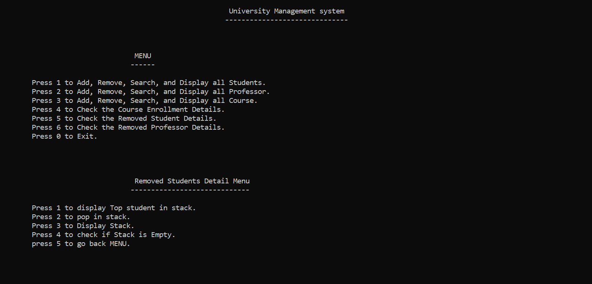

### <h1 align="center">📌 University Management System</h1>

## 📖 Project Overview  
The University Management System is a C++-based console application that efficiently manages students, professors, and courses using Data Structures and Algorithms (DSA).  
It enables users to add, remove, search, and display academic records while ensuring optimized memory management and quick retrieval operations.  
Additionally, Singly Linked Lists and Stacks are implemented to handle dynamic memory allocation, undo operations, and efficient data traversal.

## 🔥 DSA Functionality  
✔ **Singly Linked List** for **storing and managing** student, professor, and course data.  
✔ **Stack (LIFO - Last In, First Out)** for **undo operations** (restoring deleted objects).  
✔ **Optimized Searching & Traversal Algorithms** for **fast retrieval** of data.  
✔ **Insertion & Deletion Algorithms** with **O(1) time complexity** for efficient operations.  
✔ **Memory-Efficient Storage** using **pointers and dynamic memory allocation.**  

## 🚀 Features  
✅ **Manage Students, Professors, and Courses** (Add, Remove, Search, Display)  
✅ **Efficient Course Enrollment Management**  
✅ **Implements OOP Principles** (Encapsulation, Inheritance, Polymorphism)  
✅ **Association & Aggregation in Object Relationships**  
✅ **User-Friendly Command-Line Interface (CLI)**  
✅ **Data Structure Implementations: Singly Linked List & Stack**  

## 🛠️ Tech Stack  
- **Language:** C++  
- **Standard Template Library (STL) for Optimized Data Structures**  
- **CLI-based User-Friendly Interface**  

## 📸 Screenshots  

 **User-Friendly CLI** 
 
    

## 📌 Author
🔗 GitHub: [Umer Farooq Jillani](https://github.com/UmerFarooqJillani)  

---
